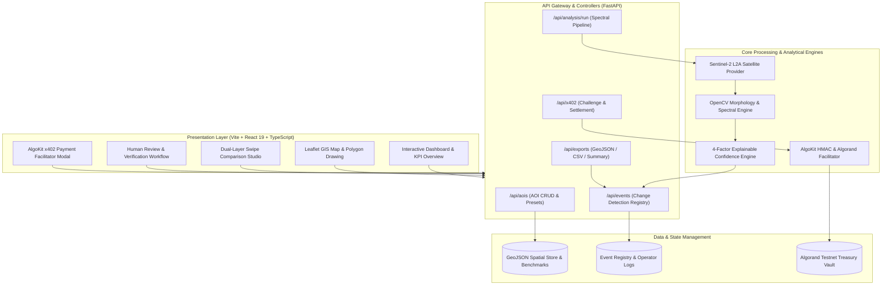
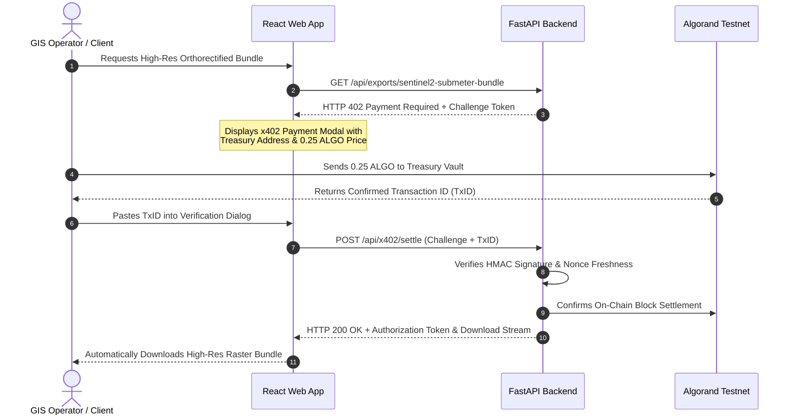

<div align="center">

# 🛰️ Kshitiraksha (क्षितिरक्षा)
### *Autonomous Satellite-Based Change Detection, Geospatial Intelligence & AlgoKit x402 Alert Platform*

[](https://fastapi.tiangolo.com)
[](https://react.dev/)
[](https://www.typescriptlang.org/)
[](https://vitejs.dev/)
[](https://opencv.org/)
[](https://leafletjs.com/)
[](https://algorand.technologies/)
[](https://opensource.org/licenses/MIT)

<p align="center">
  <b>Transforming Raw Earth Observation Data into Explainable, Verified & Actionable Geospatial Events</b>
  <br />
  <i>Built for National Remote Sensing, Forest Protection, Wetland Conservation & SIH / ISRO Hackathon Challenges</i>
</p>

[Key Features](#-key-features) •
[System Architecture](#-system-architecture) •
[UI & Wireframes](#-ui-wireframes--design-system) •
[Spectral Formulas](#-spectral--algorithmic-foundations) •
[API Reference](#-api-reference) •
[Quickstart](#-installation--local-setup) •
[AlgoKit x402](#-algokit-x402-blockchain-paywall)

---

</div>

## 📌 Executive Overview

**Kshitiraksha (क्षितिरक्षा)** — meaning *"Protection of the Earth"* — is an automated remote-sensing watchtower system. Traditional satellite monitoring is slow, labor-intensive, and prone to human error: GIS analysts must manually download gigabytes of optical imagery, align rasters, mask clouds, compute spectral indices, and inspect differences by eye.

**Kshitiraksha** eliminates this friction by delivering an autonomous, end-to-end pipeline:
1. **Area of Interest (AOI) Definition**: Define critical regions (forest reserves, protected wetlands, mining corridors, municipal boundaries) via interactive polygon drawing or preloaded national benchmarks.
2. **Multi-Temporal Satellite Ingestion**: Continuously captures multi-spectral bands (Red, Green, NIR, SWIR) from Sentinel-2 MSI (10m L2A) and Landsat 8/9.
3. **Spectral Shift & Anomaly Computation**: Computes differential vegetation (NDVI) and water (NDWI) indices to isolate real surface disturbances.
4. **Morphological De-Noising & Vectorization**: Cleans atmospheric salt-and-pepper noise using morphological opening/closing kernels and vectorizes pixel changes into GIS-compliant GeoJSON MultiPolygons.
5. **Explainable 4-Factor Confidence Scoring**: Scores change severity using magnitude, spatial coherence, cloud clearance, and temporal persistence.
6. **Human-in-the-Loop Review Studio**: Empowers field operators to inspect dual-layer interactive swipe comparisons, audit alerts, and verify or dismiss detections.
7. **AlgoKit x402 Web3 Protocol**: Implements the HTTP 402 Payment Required standard on Algorand for compute micro-billing and high-resolution commercial imagery exports.

---

## ⚡ Key Features

| Capability | Technical Details | Value Proposition |
| :--- | :--- | :--- |
| **Multi-Spectral Engine** | Differential NDVI (Vegetation) & NDWI (Water) index calculation with zero-division protection. | Detects illegal deforestation, crop failures, flood inundations, and water body shrinkage. |
| **OpenCV Noise Filtering** | Elliptical structural kernel morphology (`MORPH_OPEN` + `MORPH_CLOSE`) + connected components filtering ($A \ge 15\text{ px}$). | Eliminates false alarms caused by cloud fringes, sensor blooming, and shadows. |
| **Dynamic Swipe Studio** | Hardware-accelerated dual-raster split comparison slider with synchronized zoom & pan. | Enables instant before-and-after visual inspection of disturbed zones down to individual parcels. |
| **Explainable Confidence AI** | 4-Factor composite scoring: Spectral Magnitude + Spatial Consistency + Image Quality + Temporal Persistence. | No "black-box" decisions — every detection is accompanied by transparent, audit-ready confidence metrics. |
| **Interactive Map Workspace** | Full-featured Leaflet GIS workspace supporting GeoJSON layers, bounding boxes, polygon tools, and metric cards. | Non-GIS users can analyze national scale landscapes without specialized desktop software. |
| **Human Verification Loop** | Three-state review lifecycle (`PENDING` ➔ `CONFIRMED` / `REJECTED`) with operator field notes and audit trails. | Keeps humans firmly in the loop to prevent automated enforcement mistakes. |
| **AlgoKit x402 Paywall** | Cryptographic HMAC challenge generation, Algorand Testnet verification, and token-gated compute/exports. | Native machine-to-machine micropayments for premium analytics and satellite compute quotas. |
| **Multi-Format Export** | Live generation of GeoJSON MultiPolygons, spatial CSV data tables, and printable incident audit summaries. | Seamless integration with ArcGIS, QGIS, government dispatch centers, and field teams. |

---

## 🏗️ System Architecture

The platform adopts a decoupled, microservice-ready architecture built on FastAPI, React 19, TypeScript, and open-source geospatial tools.



---

## 📐 Spectral & Algorithmic Foundations

### 1. Normalized Difference Vegetation Index (NDVI)
Quantifies vegetative health and canopy density by measuring the differential reflection between Near-Infrared (NIR) and visible Red bands:

$$\text{NDVI} = \frac{\text{NIR} - \text{Red}}{\text{NIR} + \text{Red}}$$

$$\Delta \text{NDVI} = \text{NDVI}_{\text{recent}} - \text{NDVI}_{\text{baseline}}$$

* **Negative Delta ($\Delta \text{NDVI} \le -0.20$):** Indicates deforestation, illegal tree logging, crop harvesting, or forest fire.
* **Positive Delta ($\Delta \text{NDVI} \ge +0.20$):** Indicates afforestation or post-monsoon vegetation recovery.

### 2. Normalized Difference Water Index (NDWI)
Delineates open water bodies and tracks wetland surface moisture:

$$\text{NDWI} = \frac{\text{Green} - \text{NIR}}{\text{Green} + \text{NIR}}$$

$$\Delta \text{NDWI} = \text{NDWI}_{\text{recent}} - \text{NDWI}_{\text{baseline}}$$

* **Negative Delta ($\Delta \text{NDWI} \le -0.25$):** Indicates reservoir shrinkage, drought drying, or lakebed encroachment.
* **Positive Delta ($\Delta \text{NDWI} \ge +0.25$):** Indicates flash floods, riverbank breach, or storm surge inundation.

### 3. Noise Removal via Morphological Kernels
Raw satellite differentials contain atmospheric speckles and registration shifts. Kshitiraksha applies sequential morphological opening (erosion followed by dilation) with an elliptical structuring element $B$:

$$\text{Clean Mask} = (M \circ B) \bullet B = ((M \ominus B) \oplus B)$$

Connected components analysis filters any contiguous anomaly with area below $15\text{ pixels}$, suppressing sensor noise while preserving authentic change boundaries.

### 4. Explainable 4-Factor Confidence Score

$$\text{Confidence}_{\text{composite}} = \frac{S_{\text{magnitude}} + S_{\text{spatial}} + S_{\text{quality}} + S_{\text{persistence}}}{4}$$

Where:
* $S_{\text{magnitude}} = \min(1.0, \frac{|\Delta_{\text{mean}}|}{0.45})$ (Physical contrast of spectral shift)
* $S_{\text{spatial}} = \text{cluster cohesiveness based on pixel-to-blob ratio}$
* $S_{\text{quality}} = 1.0 - (\overline{\text{Cloud\%}} \times 0.008)$ (Atmospheric clearance penalty)
* $S_{\text{persistence}} = \text{multi-temporal baseline stability factor}$

---

## 🖥️ UI Wireframes & Design System

The system features a high-density, command-center dark theme engineered for GIS operators, defense reconnaissance, and conservation agencies.

### Wireframe 1: Executive Command Dashboard (`/`)

```text
+---------------------------------------------------------------------------------------------------------+
| [🛰️ KSHITIRAKSHA]   [Dashboard]   [Map Workspace]   [Swipe Comparison]   [Review Studio]     [Alerts: 4]|
+---------------------------------------------------------------------------------------------------------+
|                                                                                                         |
|  [ STATS OVERVIEW ]                                                                                     |
|  +-------------------+  +-------------------+  +-------------------+  +-------------------------------+ |
|  | ACTIVE AOIs       |  | DETECTED EVENTS   |  | PENDING REVIEWS   |  | TOTAL AFFECTED AREA           | |
|  | 4 Monitored Zones |  | 8 Total Incidents |  | 3 Require Action  |  | 248.5 Hectares                | |
|  +-------------------+  +-------------------+  +-------------------+  +-------------------------------+ |
|                                                                                                         |
|  [ DISTURBANCE DISTRIBUTION ]                                                                           |
|  [████████████████████████████████░░░░░░░░░░░░░░░░░░░░░░░░░░░░░░░░░░░░░░░░░░░░░░]                       |
|   🌲 Vegetation Loss: 55%    💧 Water Shrinkage: 25%    🏗️ Urban Sprawl: 15%    🔥 Fire/Burn: 5%         |
|                                                                                                         |
|  [ RECENT ANOMALIES & AUDIT FEED ]                                                                      |
|  +----------------------------------------------------------------------------------------------------+ |
|  | Severity | AOI Target           | Change Category | Area (Ha) | Conf. | Status   | Action          | |
|  |----------|----------------------|-----------------|-----------|-------|----------|-----------------| |
|  | [CRITICAL| Hasdeo Arand Forest  | VEGETATION_LOSS | 114.2 Ha  | 92.4% | PENDING  | [Swipe] [Review]| |
|  | [HIGH]   | Bellandur Wetland    | WATER_SHRINKAGE |  38.6 Ha  | 88.1% | PENDING  | [Swipe] [Review]| |
|  | [MEDIUM] | Sundarbans Biosphere | MANGROVE_LOSS   |  64.0 Ha  | 85.7% | CONFIRMED| [Swipe] [Audit] | |
|  | [LOW]    | Aravalli Ridge Zone  | EXCAVATION      |  31.7 Ha  | 79.2% | REJECTED | [Swipe] [Audit] | |
|  +----------------------------------------------------------------------------------------------------+ |
+---------------------------------------------------------------------------------------------------------+
```

### Wireframe 2: Interactive Map Workspace (`/map`)

```text
+---------------------------------------------------------------------------------------------------------+
|  [AOI SELECTOR & CONTROLS]                 |  [LEAFLET GIS INTERACTIVE SATELLITE CANVAS]                |
|                                            |                                                            |
|  Select Preset Area:                       |     +------------------------------------------------+     |
|  [ Hasdeo Arand Forest Range          v ]  |     |  [+]                                           |     |
|                                            |     |  [-] [Layer: Sentinel-2 True Color (10m)    v] |     |
|  AOI Bounds:                               |     |                                                |     |
|  * Lat: 22.800 to 22.850                   |     |         (Polygon AOI Boundary)                 |     |
|  * Lon: 82.650 to 82.720                   |     |         +-------------------------+            |     |
|  * Total Area: 1,420.5 Hectares            |     |         |   Dense Canopy          |            |     |
|                                            |     |         |     \                   |            |     |
|  Analysis Parameters:                      |     |         |      [### RED ANOMALY ###]           |     |
|  Index:      (o) NDVI    ( ) NDWI          |     |         |      [ Area: 114.2 Ha    ]           |     |
|  Sensitivity: [===|========] 0.22          |     |         |      [ Conf: 92.4%       ]           |     |
|  Baseline:   [ 2025-01-10 ]                |     |         |                         |            |     |
|  Recent:     [ 2026-02-28 ]                |     |         +-------------------------+            |     |
|                                            |     |                                                |     |
|  [⚡ RUN SATELLITE CHANGE DETECTION]       |     |  Scale: |----- 500m -----|   Lat: 22.82 N Lon: 82.68 E |     |
|  [📥 Export Selected GeoJSON]              |     +------------------------------------------------+     |
+---------------------------------------------------------------------------------------------------------+
```

### Wireframe 3: Before / After Dual-Layer Swipe Studio (`/swipe`)

```text
+---------------------------------------------------------------------------------------------------------+
|  EVENT: EVT-2026-0288 | Hasdeo Arand Forest Range | Severity: CRITICAL | Δ NDVI: -0.42                  |
+---------------------------------------------------------------------------------------------------------+
|  [<< PREVIOUS BASELINE: 2025-01-10]               ||               [RECENT SATELLITE: 2026-02-28 >>]    |
|                                                   ||                                                    |
|           Intact Forest Canopy                    ||                  Cleared Mining Pit                |
|          Dense Sal & Teak Forest                  ||               Exposed Mineral Soil & Roads         |
|                                                   ||                                                    |
|                     ▓▓▓▓▓▓▓▓▓▓▓▓▓▓▓▓              ||               ░░░░░░░░░░░░░░░░                     |
|                     ▓▓▓▓▓▓▓▓▓▓▓▓▓▓▓▓              ||               ░░░░░░░░░░░░░░░░                     |
|                     ▓▓▓▓▓▓▓▓▓▓▓▓▓▓▓▓    <======= [||] =======>     ████████████████ [RED DIFF OVERLAY]   |
|                     ▓▓▓▓▓▓▓▓▓▓▓▓▓▓▓▓              ||               ████████████████                     |
|                     ▓▓▓▓▓▓▓▓▓▓▓▓▓▓▓▓              ||               ░░░░░░░░░░░░░░░░                     |
|                                                   ||                                                    |
|  [Overlay Mode: [X] False-Color NIR  [ ] Delta Heatmap]   [Zoom: 100%]   [Reset View]   [Inspect Vector]|
+---------------------------------------------------------------------------------------------------------+
```

### Wireframe 4: Human-in-the-Loop Review Studio (`/review`)

```text
+---------------------------------------------------------------------------------------------------------+
|  [EVENT AUDIT CARD: EVT-2026-0288]         |  [EXPLAINABLE 4-FACTOR CONFIDENCE BREAKDOWN]               |
|                                            |                                                            |
|  Timestamp:     2026-02-28 14:15 UTC       |  Magnitude Shift:       [██████████████████░]  94.0%       |
|  Location:      Hasdeo Arand, CG, India    |  Spatial Consistency:   [████████████████░░]  91.5%       |
|  Coordinates:   22.825° N, 82.685° E       |  Image Quality / Clear: [███████████████████]  96.0%       |
|  Affected Area: 114.20 Hectares            |  Temporal Persistence:  [█████████████████░]  88.0%       |
|  Classification: VEGETATION LOSS           |  -------------------------------------------------         |
|  Sensor:        Sentinel-2 MSI (10m L2A)   |  COMPOSITE CONFIDENCE:  92.4% (HIGH CERTAINTY)             |
|                                            |                                                            |
|  VERIFICATION ACTION:                      |  FIELD AUDIT REMARKS / LOGS:                               |
|  [ (o) CONFIRM REAL CHANGE  ]              |  +------------------------------------------------------+  |
|  [ ( ) REJECT AS FALSE ALARM ]             |  | Forest ranger patrol dispatched. Confirmed tree      |  |
|  [ ( ) ESCALATE FOR DRONE RECON ]          |  | felling and heavy earth-moving equipment inside      |  |
|                                            |  | compartment 42A. Urgent injunction required.         |  |
|  [ SUBMIT VERIFICATION DECISION ]          |  +------------------------------------------------------+  |
+---------------------------------------------------------------------------------------------------------+
```

### Wireframe 5: AlgoKit x402 Micropayment Modal (`x402`)

```text
+-----------------------------------------------------------------------------+
|  🔒 HTTP 402: HIGH-RESOLUTION SATELLITE COMPUTE ACCESS                       |
+-----------------------------------------------------------------------------+
|  Resource: /api/exports/sentinel2-submeter-bundle                           |
|  Compute:  Sub-meter Orthorectified Multi-Spectral Change Pack               |
|                                                                             |
|  REQUIRED PAYMENT:                                                          |
|  +-----------------------------------------------------------------------+  |
|  | Amount: 0.25 ALGO (Algorand Testnet)                                  |  |
|  | Treasury Vault: ISROGEO77X402ALGORANDTESTNETVAULTWXYZ66723            |  |
|  | Challenge Nonce: c9f3a04b12e788ad | Valid for: 840s                   |  |
|  +-----------------------------------------------------------------------+  |
|                                                                             |
|  Enter Settled Algorand Transaction ID:                                     |
|  [ 7X402ALGO-99320-TXID-ABCD-88219472-SECURE                            ]   |
|                                                                             |
|  Sender Wallet Address (Optional):                                          |
|  [ 2UQWXY729...ALGORAND                                                 ]   |
|                                                                             |
|  [⚡ VERIFY TRANSACTION ON ALGORAND & UNLOCK COMPUTE]          [CANCEL]     |
+-----------------------------------------------------------------------------+
```

---

## 📁 Repository Structure

```tree
kshitiraksha/
├── backend/
│   ├── app/
│   │   ├── api/
│   │   │   ├── __init__.py
│   │   │   ├── analysis.py          # /api/analysis/run (Spectral pipeline & change detection)
│   │   │   ├── aois.py              # /api/aois (AOI CRUD & preloaded Indian benchmarks)
│   │   │   ├── events.py            # /api/events (Change event registry & human review)
│   │   │   ├── exports.py           # /api/exports (GeoJSON, CSV, and summary reports)
│   │   │   └── x402.py              # /api/x402 (HTTP 402 challenge & settlement gateway)
│   │   ├── core/
│   │   │   ├── __init__.py
│   │   │   └── config.py            # Global settings, CORS & environment configuration
│   │   ├── schemas/
│   │   │   ├── __init__.py
│   │   │   └── models.py            # Pydantic models (AOI, Event, GeoJSON, Confidence)
│   │   ├── services/
│   │   │   ├── __init__.py
│   │   │   ├── change_engine.py     # OpenCV morphology, NDVI/NDWI, polygon vectorizer
│   │   │   ├── confidence_engine.py # Explainable 4-Factor composite scoring engine
│   │   │   ├── satellite_provider.py# Sentinel-2 & Landsat optical band raster simulator
│   │   │   └── x402_facilitator.py  # Algorand AlgoKit micropayment verification service
│   │   ├── __init__.py
│   │   └── main.py                  # FastAPI application entrypoint & middleware setup
│   ├── tests/
│   │   ├── __init__.py
│   │   └── test_change_engine.py    # Unit tests for NDVI, morphology, and confidence math
│   └── requirements.txt             # Backend Python dependencies
├── frontend/
│   ├── public/
│   │   └── vite.svg
│   ├── src/
│   │   ├── assets/
│   │   ├── components/
│   │   │   ├── common/              # Header, navigation, status indicators, badges
│   │   │   ├── comparison/          # Interactive before/after split swipe slider
│   │   │   ├── dashboard/           # Metrics cards, category breakdown, incident feeds
│   │   │   ├── events/              # Event review studio, verification audit dialogs
│   │   │   ├── map/                 # Leaflet map workspace, polygon tools, layer toggles
│   │   │   └── payments/            # AlgoKit x402 micropayment modal & QR codes
│   │   ├── services/
│   │   │   ├── api.ts               # Typed REST client connecting to FastAPI backend
│   │   │   └── mockData.ts          # Benchmark AOIs (Hasdeo, Sundarbans, Bellandur, etc.)
│   │   ├── types/
│   │   │   └── index.ts             # TypeScript definitions for AOIs, events & metrics
│   │   ├── App.tsx                  # Primary layout and active tab router
│   │   ├── index.css                # Glassmorphism dark theme & design tokens
│   │   └── main.tsx                 # React DOM mount point
│   ├── index.html
│   ├── package.json
│   ├── tsconfig.json
│   └── vite.config.ts
├── prd.md                           # Comprehensive Product Requirements Document (PRD)
├── trd.md                           # In-Depth Technical Requirements Document (TRD)
└── README.md                        # Master Project Documentation
```

---

## 📡 API Reference & Specifications

Interactive OpenAPI Swagger UI is automatically hosted at `http://localhost:8000/docs`.

### Core REST Endpoints

| Method | Endpoint | Description | Auth / Paywall |
| :--- | :--- | :--- | :--- |
| `GET` | `/health` | Healthcheck and sub-engine operational statuses | Public |
| `GET` | `/api/aois` | Fetch all registered Areas of Interest (AOIs) | Public |
| `POST` | `/api/aois` | Register a new monitored geospatial boundary | Public |
| `POST` | `/api/analysis/run` | Execute NDVI/NDWI detection pipeline on specified AOI | Public |
| `GET` | `/api/events` | List all historical and real-time detected anomaly events | Public |
| `GET` | `/api/events/{id}` | Retrieve comprehensive event dossier & GeoJSON coordinates | Public |
| `PATCH`| `/api/events/{id}/review` | Human review update (`CONFIRMED`, `REJECTED`, operator notes) | Verified Operator |
| `GET` | `/api/exports/geojson` | Export filtered change polygons in RFC 7946 GeoJSON format | Public |
| `GET` | `/api/x402/challenge` | Request cryptographic HTTP 402 payment challenge | Public |
| `POST`| `/api/x402/settle` | Submit Algorand TxID to verify settlement and unlock access | x402 Protocol |

### Sample Analysis Trigger Payload (`POST /api/analysis/run`)

```json
{
  "aoi_id": "aoi-hasdeo",
  "baseline_date": "2025-01-10",
  "recent_date": "2026-02-28",
  "index_type": "NDVI",
  "sensitivity_threshold": 0.22,
  "min_cluster_pixels": 15
}
```

### Sample Analysis Response

```json
{
  "status": "SUCCESS",
  "message": "Change detection complete. Anomaly identified.",
  "event": {
    "id": "EVT-2026-HASDEO-01",
    "aoi_id": "aoi-hasdeo",
    "category": "VEGETATION_LOSS",
    "severity": "CRITICAL",
    "affected_area_hectares": 114.2,
    "delta_mean": -0.418,
    "review_status": "PENDING",
    "confidence": {
      "magnitude_score": 0.94,
      "spatial_consistency_score": 0.915,
      "image_quality_score": 0.96,
      "persistence_score": 0.88,
      "overall_detection_confidence": 0.924
    },
    "geojson_polygon": {
      "type": "MultiPolygon",
      "coordinates": [...]
    }
  }
}
```

---

## 🚀 Installation & Local Setup

### Prerequisites
* **Python 3.10+** (Tested on Python 3.11 & 3.12)
* **Node.js 18+** & **npm 9+**
* Modern web browser with WebGL enabled

### 1. Clone the Repository
```bash
git clone https://github.com/arpit0381/Kshitiraksha.git
cd Kshitiraksha
```

### 2. Backend Setup
```bash
# Navigate to backend directory
cd backend

# Create virtual environment
python -m venv venv

# Activate virtual environment
# Windows (PowerShell):
.\venv\Scripts\Activate.ps1
# Linux / macOS:
# source venv/bin/activate

# Install dependencies
pip install -r requirements.txt

# Run automated tests
pytest tests/

# Launch FastAPI Server with Auto-Reload
uvicorn app.main:app --host 0.0.0.0 --port 8000 --reload
```
* Backend will be live at: `http://localhost:8000`
* Interactive Docs at: `http://localhost:8000/docs`

### 3. Frontend Setup
```bash
# Open a new terminal and navigate to frontend directory
cd frontend

# Install Node modules
npm install

# Start Vite Development Server
npm run dev
```
* Frontend will be live at: `http://localhost:5173`

---

## 💎 AlgoKit x402 Blockchain Paywall

Kshitiraksha natively incorporates the **HTTP 402 Payment Required** standard powered by **Algorand (AlgoKit)**:



---

## 🎯 Real-World Benchmark Scenarios

| Region | Environmental Threat | Sensor & Detection Band | Resulting Action |
| :--- | :--- | :--- | :--- |
| **Hasdeo Arand (Chhattisgarh)** | Open-cast coal mining encroachment into pristine Sal forest. | Sentinel-2 MSI (B04 Red, B08 NIR) $\Delta\text{NDVI} \le -0.35$. | Generates high-confidence alert with boundary polygon; dispatched to forest conservator. |
| **Sundarbans Biosphere (WB)** | Tidal erosion, mangrove deforestation, and rising salinity. | Multi-spectral NDVI + NDWI composite analysis. | Tracks progressive mangrove canopy shrinkage across tidal mudflats. |
| **Bellandur Wetland (Bengaluru)** | Encroachment on buffer zones and toxic industrial water loss. | Sentinel-2 NDWI (B03 Green, B08 NIR) $\Delta\text{NDWI} \le -0.28$. | Flags unpermitted landfilling and lake shrinkage for municipal authorities. |

---

## 🗺️ Roadmap & Future Enhancements

- [x] Multi-spectral NDVI & NDWI change detection pipeline
- [x] Morphological OpenCV de-noising & connected components filtering
- [x] Explainable 4-Factor confidence estimation
- [x] Interactive dual-layer before/after swipe comparison slider
- [x] Human-in-the-loop review studio with field audit logs
- [x] AlgoKit x402 Web3 micropayments on Algorand
- [ ] **Sentinel-1 SAR Radar Integration**: Penetrate perpetual monsoon cloud cover using C-Band Synthetic Aperture Radar.
- [ ] **Automated Drone Dispatch Webhooks**: Direct MAVLink / DroneKit trigger for automated aerial inspection of critical alerts.
- [ ] **Decentralized Conservation DAO**: On-chain community staking for citizen-science ground validation.

---

## 👥 Contributors & Acknowledgements

* **Samriddhi Bansal, Arpit Bajpai, Aviral Mishra, Lavanya Sachan and Manikant Awasthi** — *Core Engineering, GIS Modeling, & Full-Stack Architecture*
* **Indian Space Research Organisation (ISRO)** & **Bhuvan** for Earth Observation data architectures and problem definitions.
* **Copernicus Sentinel-2** open access program for high-cadence 10m multi-spectral imagery.
* **Algorand Foundation & AlgoKit** for frictionless, sub-second micropayment primitives.

---

<div align="center">
  <b>Built with ❤️ for Earth Conservation & Hackathon Innovation</b><br />
  <sub>Protected by the MIT License • 2026 Kshitiraksha Team</sub>
</div>
